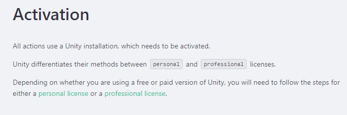

CICD for Unity - NEW Github Actions
======

目錄
------
+ 建立git
+ 設置git action
+ 清單
+ 標註
+ 區塊
+ 程式碼
+ 分隔線
+ 超連結
+ 圖片
+ 表格

建立git
------
1. 在github上建立專案

2. 在本地端新增.gitignore

3. 內容要google "gitignore.io"
<https://www.toptal.com/developers/gitignore>
輸入"Unity" 搜尋範例複製

4. 新增.gitignore 貼上code

5. 建立local端git 連結github
<<<<<<< HEAD

6. git
```
git init
git add .
git commit -m "first commit"
git branch -M main
git remote add origin github連結
git push -u origin main
```


設置git Action
------
1. 新增.github資料夾 在裡面建立 workfloews資料夾
<https://game.ci/docs/github/activation>

2. 2

3. 到<https://game.ci/docs/github/activation> 複製Acquiring an activation file
新增activation.yml
```
touch activation.yml
```
打開activation.yml
將Acquiring an activation file的code貼上
4. push to github
5. 到github Action run workflow

run個幾分鐘

完成後點進去可以下載 .alf
6. and then open the .alf copy the key
7. 到github ->setting -> secrets
新增一個UNITY_LICENSE
把value 貼上.alf的內容
9. 接下來到GAME CI 的Builder最底下Complete example複製
<https://game.ci/docs/github/builder>
11. 到workflows 新增main.yml貼上


 - Check acrion
 	+ clone master分支
 - 

12. 修改main.yml  只在

14. d
15. 

=======


